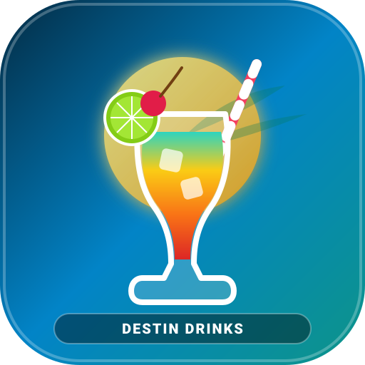

# 🍸 Smart Bar Mixology

> **Intelligent Batch Cocktail Calculator, Live Liquor Pricing, & 46 Authentic Vacation & Beach Bar Recipes.**

A fast, responsive Progressive Web App (PWA) designed for vacation rentals, beach condos, group parties, and home mixology. Features exact 1-gallon batch pitcher math, 32-oz vessel scaling, live retail bottle inventory pricing, restaurant/bar menu cost comparisons, and instant filtering by cocktail style.

🔗 **Live App:** [https://keysersoze22.github.io/smart-bar-mixology/](https://keysersoze22.github.io/smart-bar-mixology/)

---

## ✨ Features

- **🍸 46 Authentic Cocktail Recipes:**
  - **Beach Bar & Punch Classics (14):** 32-oz Beach Buckets, Ultimate Porch Punch, Craft Margaritas (Grand Sunset, Strawberry, Mango, Jalapeño, Dragon Fruit), Mudslides, Rum Runners, and Painkillers.
  - **Coastal Irish Pub Classics (12):** The Famous Irish Wake, Emory Chenoweth, Iced Irish Coffee, Dublin Mules, Craft Martinis, and Tavern Old Fashioneds.
  - **Coastal Steamer & Bay Specialties (8):** The Steamer "BLT" (Bourbon, Lemonade & Sweet Tea), Bahama Mamas, Seafood Bloody Marys, and the Coastal Bushwacker.
  - **Resort & Vacation Classics (12):** 1944 Mai Tai, Piña Colada, Classic Mojito, Paloma, Moscow Mule, Espresso Martini, and Dark 'n Stormy.
  - **Zero-Proof Mocktails (4):** Non-alcoholic options for all ages.

- **💰 Live Liquor & Ingredient Pricing vs. Bar Menu Costs:**
  - **Real Bar Menu Pricing:** Compares every cocktail against what beachfront bars, pubs, and taverns charge ($14.00 – $24.00+).
  - **DIY Vacation Batch Cost:** Exact calculated cost per pour (~$2.40 – $4.10 for full 32-oz vessels).
  - **Group Savings Calculator:** Live percentage and dollar savings per drink and for your entire group tab.
  - **Retail Bottle Benchmarks:** Live pricing and yield math for 1.75L economy handles and 750ml premium bottles.

- **🧂 Master Filter & Sort Hub:**
  - Filter drinks by **WHAT they are**: Margaritas (7), Whiskey & Bourbon (6), Beach Buckets & Punches (6), Tiki & Tropical (7), Martinis & Sours (5), Mules & Highballs (7), Creamy Dessert (3), Bloody Marys (3), or Mocktails (4).
  - Filter by Base Spirit (Rum, Tequila, Vodka, Whiskey, Gin, Non-Alcoholic) and Venue.
  - Sort by **Biggest Bar Savings ($$$)**, Highest Bar Price, Lowest DIY Batch Cost, Name (A–Z), or Alcohol Potency.

- **🚀 Navigation & Mobile QOL Suite:**
  - **Horizontal Pill Carousels:** One-tap switching with active gradient glow and auto-scroll centering.
  - **Recipe Steppers (`◀ Prev` / `Next ▶`):** Flip sequentially through cocktails directly on the card with live drink counters.
  - **Touch Swipe Gestures:** Swipe left/right on phones to browse adjacent cocktails.
  - **Universal Live Search (`/` or `Ctrl+K`):** Instant search across all 46 drinks, spirits, ingredients, and venues.
  - **Dynamic Scrollspy:** Desktop sticky navigation and mobile bottom dock highlight active sections in real-time.
  - **Floating Quick Cart & Back to Top:** Never lose track of selected drinks while browsing.

- **📲 Progressive Web App (PWA):**
  - Installable on iOS (Safari Add to Home Screen) and Android / Chrome (1-tap install).
  - Offline Service Worker caching with `sw.js` and `manifest.webmanifest`.

---

## 🚀 Live Demo & Deployment

The app is published live on GitHub Pages:
👉 **[https://keysersoze22.github.io/smart-bar-mixology/](https://keysersoze22.github.io/smart-bar-mixology/)**

You can also run it locally by opening `index.html` directly in any web browser or via a local static server.

---

## 🛠️ Tech Stack

- Single-page application architecture (Vanilla JavaScript, HTML5, Modern CSS3 with CSS Variables).
- Zero build tools or external bundle dependencies required.
- Native Service Worker (`sw.js`) and Web App Manifest (`manifest.webmanifest`).

---

## 📄 License

MIT License. Free for personal vacation planning, home entertaining, and mixology.
